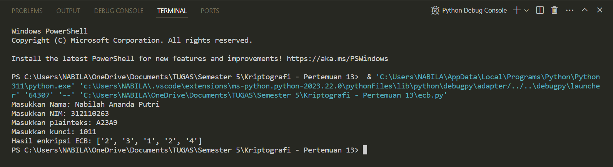

# Profil
| #               | Biodata                 |
| --------------- | ----------------------- |
| **Nama**        | Nabilah Ananda Putri    |
| **NIM**         | 312110263               |
| **Kelas**       | TI.21.A.1               |
| **Mata Kuliah** | Kriptografi             |

## Hasil


## Fungsi `encrypt_ecb`
- Step 3: Mengonversi plainteks dari format heksadesimal ke biner.
```py
def encrypt_ecb(plaintext_hex, key_bin):
    # Step 3: Rubah plainteks hexadecimal ke biner
    plaintext_bin = bin(int(plaintext_hex, 16))[2:]
```
- Step 4: Memisahkan biner plainteks menjadi blok-blok berukuran 4 bit.
```py    
    # Step 4: Pisah per blok 4 bit sesuai panjang blok
    block_size = 4
    plaintext_blocks = [plaintext_bin[i:i+block_size] for i in range(0, len(plaintext_bin), block_size)]
```
- Step 5: Melakukan operasi XOR antara biner plainteks dan kunci.
```py
 # Step 5: XOR-kan biner plainteks per blok dengan kunci
    encrypted_blocks = []
    for block in plaintext_blocks:
        xor_result = bin(int(block, 2) ^ int(key_bin, 2))[2:].zfill(block_size)
```
- Step 6: Melakukan pergeseran satu bit ke kiri pada hasil XOR.
```py
# Step 6: Geser tiap blok 1 bit ke kiri
        shifted_result = xor_result[1:] + xor_result[0]
```
- Step 7: Mengonversi hasil pergeseran XOR ke format heksadesimal dan menyimpannya dalam bentuk array.
```py
# Step 7: Hasil XOR konversi ke hexadecimal
        encrypted_blocks.append(hex(int(shifted_result, 2))[2:].upper())

    return encrypted_blocks
```

## Input Pengguna
```py
# Input plainteks dan kunci
plaintext_hex = input("Masukkan plainteks dalam hexadecimal: ").upper()
key_bin = input("Masukkan kunci biner: ")
```

## Enkripsi ECB
```py
# Enkripsi ECB
result = encrypt_ecb(plaintext_hex, key_bin)
```

## Output Enkripsi
```py
# Output hasil enkripsi
print("Hasil enkripsi ECB:", result)
```
        
